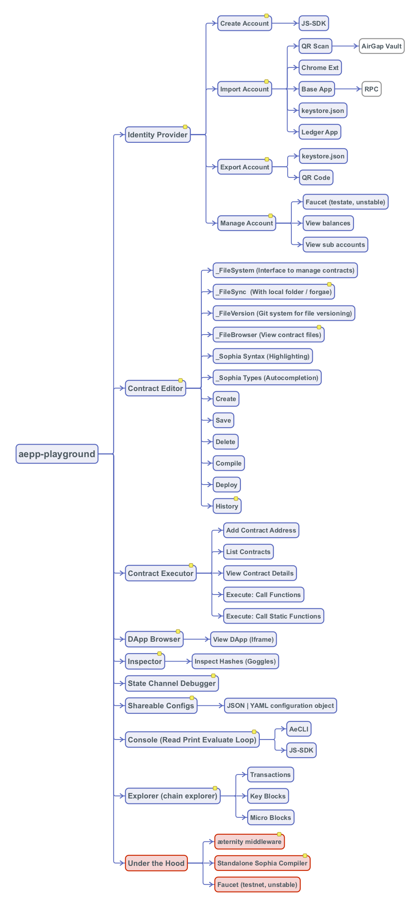

## This repository has been archived on 20.02.2023
The reason for the retirement is that the IDE is not used anymore.

# Aepp Playground
æpp Playground is a full-featured Integrated Development Environment (IDE) built for the `æternity blockchain`.

Blockchains and Development of Blockchain based applications (called DApps) have specific requirements when it comes
to developing on top of them. Coming from a traditional development style, its quite hard to wrap your head around
some concepts that exist solely on blockchains. Things like smart-contracts, protocols, RPC, nodes, Transactions, 
cryptography are all difficult things to grasp on their own, imagine trying to figure things out all together.

Our aim with æpp Playground is to not only create a IDE, but at the same time have in-app learning journeys, where we
take the developer from knowing nothing about blockchains to developing full fledged (production ready) applications 
on top of æternity.

## Requirements
List of requirements that you'll need to have to run the application locally.

- nodejs
- docker

## Functionality
As of now not all the features we have in plan on developing are available, as time goes on, we'll add more
functionality to the application, but for now, functionality that you can use are as following:

#### Editor
The `Editor` is your go to place to develop and deploy `Sophia` Contracts, as of now is has code highlighting,
a small console that logs are outputted (but with more functionality to come), and a sidebar that you can modify
deployment variables.

#### Browser
The `browser` is a tool that will help you test and run DApps, it automatically interfaces between your DApp, and
the account you have setup in the `æpp Playground`, in this way you can deploy and debug your transactions
and many more things.

#### Config
The config is your go-to place to setup your account, or other configuration variables that the tools are using,
in this way you can have the flexibility of a truly config.json, but at the same time, you can share these configurations
with other developers, so you can replicate the same state if the tool is used for debugging.

## Visual Roadmap


##### Read more about our _[Roadmap](./ROADMAP.md)_

## Project setup
```
npm install
```

### Compiles and hot-reloads for development
```
npm run serve
```

### Compiles and minifies for production
```
npm run build
```

### Run your tests
```
npm run test
```

### Lints and fixes files
```
npm run lint
```

__Some things here don't work yet. This is a work in progress. Hit up the 'Issues' if you wanna discuss
something, or wanna know more.__

### Customize configuration
See [Configuration Reference](https://cli.vuejs.org/config/).
